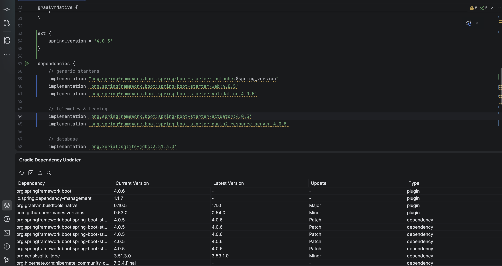

# Gradle Dependency Updater For Intellij

## Overview



The Gradle Dependency Updater plugin helps you keep your Gradle dependencies up to date by:

- Automatically detecting outdated dependencies in `build.gradle` files
- Providing visual inline hints showing available updates
- Offering quick-fix intentions (Alt+Enter) to update dependencies to:
  - Latest patch version (e.g., 1.2.3 → 1.2.4)
  - Latest minor version (e.g., 1.2.3 → 1.3.0)
  - Latest major version (e.g., 1.2.3 → 2.0.0)
- Batch updating all dependencies with a single click
- Supporting both regular dependencies and Gradle variable references (e.g., `$spring_version`)
- Smart caching to minimize network requests
- Configurable version policies (stable only, include/exclude patterns)
- Support for Maven Central and private Nexus repositories

## Getting Started

### Prerequisites

- Java 17 or higher
- IntelliJ IDEA 2025.2 or higher (or any JetBrains IDE based on IntelliJ Platform 2025.2+)
- Gradle 9.5.0 or higher

### Building from Source

1. **Clone the repository**
   ```bash
   git clone https://github.com/clementherve/intellij-java-dependencyupdater-plugin.git
   cd intellij-java-dependencyupdater-plugin
   ```

2. **Build the plugin**
   ```bash
   ./gradlew buildPlugin
   ```

   This creates a plugin distribution in `build/distributions/`.

### Running in Development Mode

To test the plugin in a sandboxed IntelliJ IDEA instance:
```bash
./gradlew runIde
```

## Installation

### Option 1: Install from Build Artifact (Recommended)

1. **Build the plugin**
   ```bash
   ./gradlew buildPlugin
   ```

2. **Locate the plugin file**

   The plugin ZIP file will be in:
   ```
   build/distributions/intellij-java-dependencyupdater-plugin-0.0.1.zip
   ```

3. **Install in IntelliJ IDEA**
   - Open IntelliJ IDEA
   - Go to **Settings/Preferences** → **Plugins**
   - Click the gear icon (⚙️) → **Install Plugin from Disk...**
   - Select the ZIP file from `build/distributions/`
   - Click **OK**
   - Restart IntelliJ IDEA

### Option 2: Run in Sandbox (Development Mode)

For quick testing without installing:
```bash
./gradlew runIde
```

This launches a separate IntelliJ IDEA instance with the plugin pre-installed.

## Configuration

After installation, configure the plugin:

1. Go to **Settings/Preferences** → **Tools** → **Dependency Updater**
2. Configure:
   - **Trigger Mode**: When to check for updates (On project open, On file save, or Manual)
   - **Cache TTL**: How long to cache version information (default: 30 minutes)
   - **Show inlay hints**: Display inline version information
   - **Version Policies**: Rules for filtering versions (e.g., stable only, exclude patterns)
   - **Nexus Repository**: Optional custom repository URL, username, and password
   - **Fallback to Maven Central**: Whether to check Maven Central if Nexus fails

## Development

### Running in Debug Mode

To debug the plugin:
```bash
./gradlew runIde --debug-jvm
```

Then attach a remote debugger on port 5005.